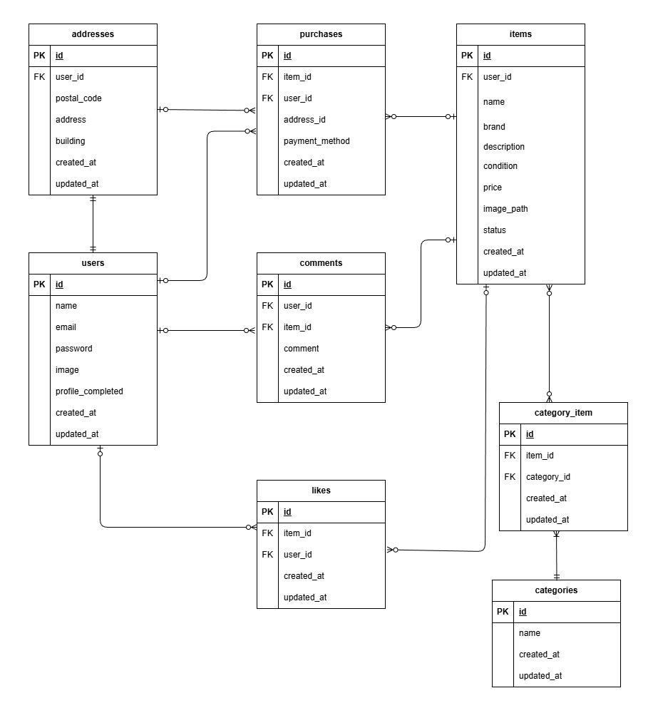

# アプリケーション名

Flea-market(フリマアプリ)

## 環境構築

### Dockerビルド

1. git clone git@github.com:kokoro28k/flea-market.git
2. DockerDesktopアプリを立ち上げる
3. docker-compose up -d --build

### Laravel環境構築

1. docker compose exec php bash
2. composer install
3. cp .env.example .env  
   .envに以下の環境変数を追加してください。

```
DB_CONNECTION=mysql
DB_HOST=mysql
DB_PORT=3306
DB_DATABASE=laravel_db
DB_USERNAME=laravel_user
DB_PASSWORD=laravel_pass
```

4. アプリケーションキーの作成

```
php artisan key:generate
```

5. Stripeのキーを.envに設定
   値はGithubに含まれないため、取得し設定してください。

```
STRIPE_KEY=（公開鍵）
STRIPE_SECRET=（秘密鍵）
```

6. メール認証のためのMailHog設定を.envに追加
   以下の環境変数を追加してください。

```
MAIL_MAILER=smtp
MAIL_HOST=mailhog
MAIL_PORT=1025
MAIL_USERNAME=null
MAIL_PASSWORD=null
MAIL_ENCRYPTION=null
MAIL_FROM_ADDRESS="noreply@example.com"
MAIL_FROM_NAME="Flea Market"
```

※ MailHogは　http://localhost:8025 で確認できます。

7. テスト環境の設定(.env.testing)

- .env.testingを作成する

```
cp .env .env.testing
```

- .env.testingを以下の内容に書き換えてください。

```
APP_ENV=test
APP_KEY=
APP_DEBUG=true
DB_CONNECTION=mysql_test
DB_HOST=mysql
DB_PORT=3306
DB_DATABASE=flea_market_test
DB_USERNAME=root
DB_PASSWORD=root
```

- テスト用のアプリケーションキーを作成

```
php artisan key:generate --env=testing
php artisan config:clear
```

8. マイグレーションの実行

```
php artisan migrate
```

9. シーディングの実行

```
php artisan db:seed
```

ユーザーのメールアドレス:test@example.com
ユーザーのパスワード: 12345678

10. storage:link の実行

```
php artisan storage:link
```

11. テスト用データベースの作成(初回のみ)

```
docker compose exec mysql bash
mysql -u root -p
CREATE DATABASE flea_market_test;
```

12. テスト用DBにマイグレーションを実行

```
php artisan migrate --env=testing
```

## トラブルシューティング

### VSCodeで.envを保存できない(EACCESエラー)

WSL環境でVSCodeから、.envを保存しようとすると、以下のエラーが出ることがあります。

```
EACCES: permission denied
```

対処方法(WSL内で実行)

```
sudo chown -R $USER:$USER .
```

### migrate実行時に1030エラーが出る(MYSQLのデータ破損)

migrateを実行したときに、以下のエラーが出る場合があります。

```
SQLSTATE[HY000]: General error: 1030 Got error 168 - 'Unknown (generic) error from engine'
```

対処方法

1. コンテナ停止

```
docker compose down
```

2. MYSQLのデータフォルダを削除

```
rm -rf docker/mysql/data
```

3. 再起動

```
docker compose up -d --build
```

4. 再度migrate

```
docker compose exec php bash
php artisan migrate
```

### localhostを開こうとして、strageの権限エラーが出る

Laravelがstorage/logsやstorage/framework/viewsに書き込めず、Permission deniedが発生する。
原因は、storageとbootstrap/cacheの所有者がrootのままで、www-dataが書き込めないため。

対処方法

```
docker compose exec php bash
chown -R www-data:www-data storage bootstrap/cache
chmod -R 775 storage bootstrap/cache
```

### MYSQLコンテナが起動していない(Connection refused)

ユーザー登録やログインなど、DBアクセス時に以下のようなエラーが発生する。

```
SQLSTATE[HY000] [2002] Connection refused
```

対処方法
プロジェクトのルートで以下を実行し、MYSQLコンテナを起動する。

```
docker compose up -d
docker ps   # mysql
```

## URL

- 開発環境: http://localhost/
- phpMyAdmin: http://localhost:8080/
- MailHog: http://localhost:8025

## 使用技術

- PHP 8.1(FPM)
- Laravel 8.x
- MySQL 8.0.26
- Docker / docker-compose
- nginx 1.21.1
- Stripe API

## ER図



## ログイン後の遷移仕様

- 初回ログイン時、メール認証が未完了の場合は、メール認証誘導画面へ遷移する。
- メール認証完了後、 users.profile_completed が false の場合は、プロフィール設定画面へ遷移する。
- プロフィール設定完了後に true に更新される。
- 2回目以降のログインは、トップページへ遷移する。

## テストファイル構成

### RegisterTest.php

- 会員登録機能

### LoginTest.php

- ログイン機能
- ログアウト機能

### ItemTest.php

- 商品一覧取得
- マイリスト一覧取得
- 商品検索機能
- 商品詳細情報取得

### LikeTest.php

- いいね機能

### CommentTest.php

- コメント送信機能

### PurchaseTest.php

- 商品購入機能
- 支払い方法選択機能
- 配送先変更機能

### ProfileTest.php

- ユーザー情報取得
- ユーザー情報変更

### SellTest.php

- 出品商品情報登録

### VerifyEmailTest.php

- メール認証機能

### テストの実行方法

以下のコマンドでテストを実行できます。

```
php artisan test
```
